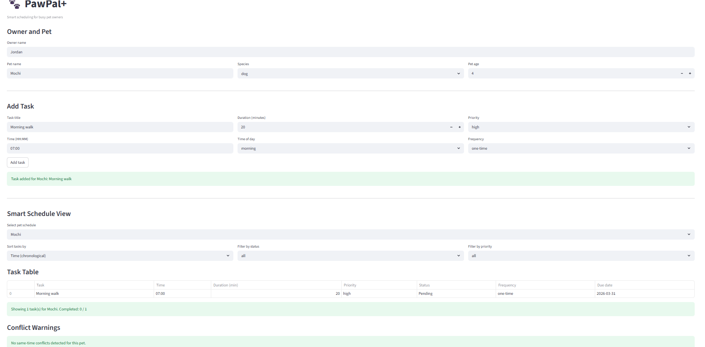

# PawPal+ (Module 2 Project)

You are building **PawPal+**, a Streamlit app that helps a pet owner plan care tasks for their pet.

## Scenario

A busy pet owner needs help staying consistent with pet care. They want an assistant that can:

- Track pet care tasks (walks, feeding, meds, enrichment, grooming, etc.)
- Consider constraints (time available, priority, owner preferences)
- Produce a daily plan and explain why it chose that plan

Your job is to design the system first (UML), then implement the logic in Python, then connect it to the Streamlit UI.

## What you will build

Your final app should:

- Let a user enter basic owner + pet info
- Let a user add/edit tasks (duration + priority at minimum)
- Generate a daily schedule/plan based on constraints and priorities
- Display the plan clearly (and ideally explain the reasoning)
- Include tests for the most important scheduling behaviors

## Features

- Owner and pet management with support for multiple pets in one household.
- Task scheduling with title, duration, priority, time, completion status, and recurrence settings.
- Sorting by time using HH:MM values for chronological daily planning.
- Filtering by completion status, priority, and pet name for focused schedule views.
- Daily and weekly recurrence that auto-creates the next task instance when a recurring task is completed.
- Conflict warnings that flag duplicate task times (single-pet and multi-pet views) without crashing or blocking workflow.
- Next available slot recommendation that scans existing scheduled intervals and suggests the earliest non-overlapping HH:MM start time.
- Non-blocking scheduler behavior: warnings guide decisions while still allowing flexible planning.
- Streamlit UI with table-based schedule display, success/warning feedback, and interactive filtering.
- Automated test coverage for core algorithmic behavior: sorting correctness, recurrence creation, and conflict detection.

## Getting started

### Setup

```bash
python -m venv .venv
source .venv/bin/activate  # Windows: .venv\Scripts\activate
pip install -r requirements.txt
```

### Suggested workflow

1. Read the scenario carefully and identify requirements and edge cases.
2. Draft a UML diagram (classes, attributes, methods, relationships).
3. Convert UML into Python class stubs (no logic yet).
4. Implement scheduling logic in small increments.
5. Add tests to verify key behaviors.
6. Connect your logic to the Streamlit UI in `app.py`.
7. Refine UML so it matches what you actually built.

## Smarter Scheduling (Phase 4: Algorithmic Layer)

PawPal+ now includes intelligent scheduling algorithms that make task management more efficient:

### ✨ Sorting & Filtering
- **Chronological Sorting** (`sort_by_time()`) — Organize tasks by time of day (HH:MM format)
- **Status Filtering** — Separate completed tasks from pending ones
- **Priority Filtering** — Isolate high-priority tasks for quick review
- **Pet-Specific Filtering** — View tasks for individual pets or combined household view

### 🔄 Automatic Recurring Tasks
- **Daily & Weekly Recurrence** — Mark a task complete to auto-generate tomorrow's or next week's instance
- **Smart Date Calculation** — Uses Python's `timedelta` for accurate date math (`today + 1 day` or `today + 1 week`)
- **Task History** — Completed tasks remain in history while new instances are created

### ⚠️ Conflict Detection
- **Lightweight Strategy** — Identifies tasks scheduled at the same time without blocking operations
- **Single-Pet Detection** (`detect_conflicts()`) — Finds overlapping tasks for one pet
- **Multi-Pet Detection** (`detect_conflicts_all_pets()`) — Highlights scheduling inefficiencies across household
- **Pre-Flight Checks** (`check_conflicts_for_task()`) — Warns about conflicts before adding new tasks

### 🧠 Advanced Capability: Next Available Slot
- **Duration-Aware Slot Search** (`find_next_available_slot()`) — Suggests the earliest open start time for a new task within a configurable time window
- **Interval Overlap Logic** — Uses each task's duration to avoid partial overlaps, not just exact-time matches
- **UI Action** — Streamlit includes a "Find next available slot" action that returns a clear recommendation or a non-blocking warning

## Agent Mode Implementation Notes

Agent Mode was used to implement the advanced scheduling feature in an iterative, architecture-first workflow:

1. Proposed candidate algorithms and selected **next available slot** because it extends current behavior beyond exact conflict checks.
2. Implemented logic directly in the scheduler layer so UI and tests could reuse one source of truth.
3. Added validation for invalid time windows and non-positive durations to keep runtime behavior predictable.
4. Integrated the method into Streamlit with `st.success` / `st.warning` feedback for user-friendly outcomes.
5. Added automated tests for both success and no-slot cases before finalizing docs.

This kept the design clean: algorithm in backend, presentation in UI, and confidence via tests.

### 📊 Algorithm Design Philosophy
These algorithms prioritize **clarity and simplicity** for educational value:
- Exact time matching (HH:MM) rather than duration-based overlap detection
- Clear variable naming and logical flow over extreme optimization
- Non-blocking warnings to maintain user control and flexibility

See [PHASE4_STEP5_ANALYSIS.md](PHASE4_STEP5_ANALYSIS.md) for algorithm tradeoff discussions and design rationale.

## Testing PawPal+

Run the automated test suite with:

```bash
python -m pytest
```

Current tests cover the most important algorithmic behaviors:
- Sorting correctness: verifies tasks are returned in chronological order.
- Recurrence logic: verifies completing a daily task creates a new task for the next day.
- Conflict detection: verifies duplicate task times are flagged with warning messages.

Confidence Level: 5/5 stars based on consistently passing test runs.

## 📸 Demo

Final Streamlit app screenshot:



Updated app screenshot after adding advanced features (challenge 1 and 3):

.png)
