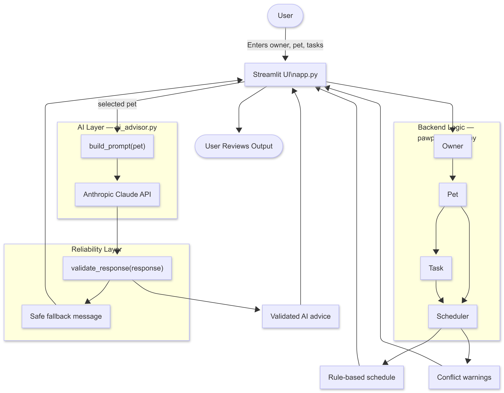
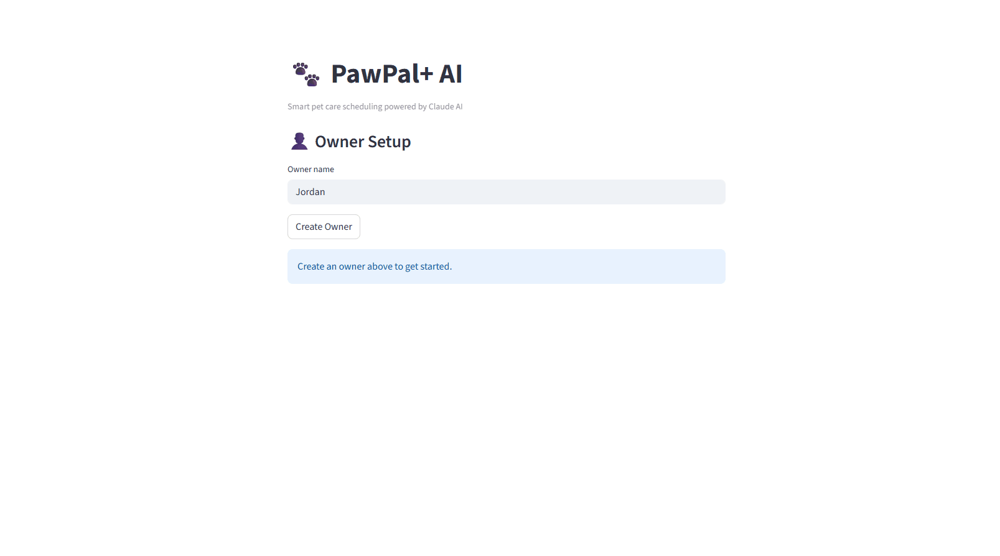

# PawPal+ AI — Smart Pet Care Assistant

## Base Project

PawPal+ from Module 2 was the base project for this final version. It began as a rule-based pet care scheduler built with Python OOP and Streamlit that let owners register pets, add tasks with priority levels, and generate a daily schedule.

## What's New

This final project adds an AI Care Advisor powered by the Anthropic Claude API. After the rule-based scheduler runs, Claude analyzes the pet's profile and tasks and returns personalized natural-language care advice tailored to the specific schedule.

## System Architecture

- Streamlit UI (`app.py`) provides the interactive interface for creating pets, adding tasks, generating schedules, and displaying AI advice.
- Backend Logic (`pawpal_system.py`) handles the core pet, task, and scheduler models used by the app.
- AI Advisor (`ai_advisor.py`) builds the prompt, calls the Anthropic Claude API, and returns personalized advice.
- Guardrail Layer validates AI output before it is shown to the user so the app can fall back safely when needed.

## Setup Instructions

1. Clone the repo
2. Create and activate virtual environment
3. Install dependencies with pip install -r requirements.txt
4. Create .env file with ANTHROPIC_API_KEY=your_key_here
5. Run with streamlit run app.py

## Sample Interactions

- Example 1: Mochi 3-year-old cat

- Example 2: Buddy, 5-year-old dog
 

## Design Decisions

- Rule-based scheduling runs before AI so the app works even if the API is down.
- Guardrails validate AI output before display to prevent empty, incomplete, or unsafe responses.
- Plain string priorities were chosen over enum for simpler UI integration.

## Testing Summary

9 out of 9 tests passed. The guardrail layer successfully blocked empty and overly short responses. One bug found and fixed: priority type mismatch between UI strings and scheduler enum - resolved by normalizing at the model boundary.

## Reflection

Building AI systems responsibly means treating the model as one part of a larger application instead of trusting it blindly. The guardrail layer made the system more reliable by checking responses before they reached the user and providing a safe fallback when needed. This project reinforced the value of keeping deterministic business logic separate from AI-generated content so the app remains useful even when external services fail. It also showed how AI can collaborate with structured software to improve the user experience without replacing core logic.

## Requirements

- Python 3.10+
- streamlit>=1.30
- anthropic
- python-dotenv
- pytest>=7.0
